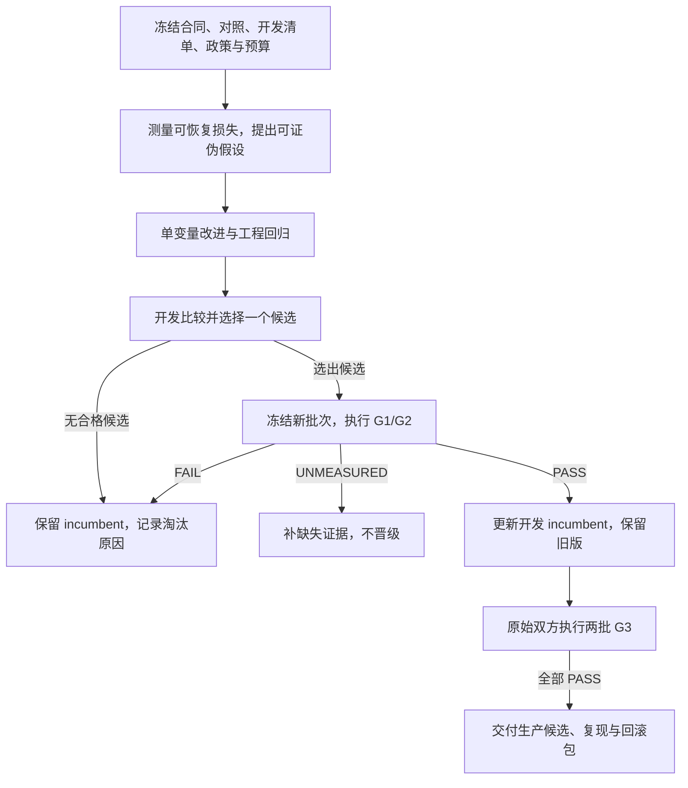

## Executive summary (read this first)

This plan defines three internal acceptance levels: reliable delivery, repeatable quality improvement, and production validation. Each promotion compares an immutable candidate with its frozen incumbent on fresh evidence. Development selection, acceptance and production confirmation have separate decisions and recorded budgets. Missing evidence remains unmeasured, and failed units stay in the score. Passing these levels creates an internal release candidate; only the organisers can establish a winning rank.

# Track 4 夺冠路径与迭代验收计划

## 1. 当前状态与规则来源

执行检查点（2026-09-16）：goal 为 `BLOCKED`。冻结候选 `8030a18`、对照 `83910c1` 的 G1 仅在声明的本地工程清单上通过；G2/G3 为 `UNMEASURED`，正式验收登记没有晋级或生产候选。评测控制链已具备批次登记、预算、开发选优、G2 晋级/回滚及双批生产确认能力；后续控制链修改不等于预测版本晋级。

当前缺口是合格的新独立多领域数据、完整的选优/首次可得时间/工件资格证据，以及获准的生产 judge 与运行等价性。公开来源探查、历史快照与容器身份核验保存在私有证据目录，不能替代这些验收条件。工程 CI 或 PR 合并不改变 goal 状态。

官方评分器同步已由 [PR #10](https://github.com/youxuanxue/track4-analysis-public/pull/10) 合入 `main`；[PR #9](https://github.com/youxuanxue/track4-analysis-public/pull/9) 在此基础上交付评测闭环。规则来源快照为 Track 4 `23da074`、共享仓库 `fbc57d29`（2026-09-15）。进入新实验前核对以下权威工件；合同或 judge 变化时，在同一新环境重跑双方。

| 权威来源 | 用途 |
| --- | --- |
| [官方评分实现](https://github.com/Agenthon-2026/track4-analysis-public/tree/23da0746010f19f21f8b180953477fcd19675351/qfbench2_track_analysis)、[toolkit 安装说明](../README.md) | 固定评分器与共享 toolkit 源码身份，禁止改评分数学提高结果 |
| [提交合同](../SUBMISSION_CLI.md)、[训练政策](TRAINING-POLICY.md) | 核对运行资源、模型/adapter 类别、cutoff 和来源证明 |
| [生产 judge 答复](https://github.com/Agenthon-2026/track4-analysis-public/issues/1#issuecomment-5630517228) | 最近核查的答复仍未公布生产规格；本地 smoke/Development 不在生产评分尺度 |
| [训练工件讨论](https://github.com/Agenthon-2026/track4-analysis-public/issues/8)、[发布节奏](https://github.com/Agenthon-2026/track4-analysis-public/issues/2) | 核对未决许可及正式版本公告，不凭旧评论推断规则已落地 |

术语见 [CONCEPTS.md](CONCEPTS.md)。incumbent 是当前保留版本，candidate 是待验收版本；晋级仅指内部更换版本。

## 2. 验收目标

每层记录 `PASS`（证据完整且合格）、`FAIL`（实测不合格）或 `UNMEASURED`（缺条件或测量）。失败单位保留官方最坏分并计入分母；组织方或数据故障中止评测，不改记参与者失败。缺失运行或分数不能删除后继续宣称均分有效。

| 目标 | 通过条件 | 必备证据 |
| --- | --- | --- |
| G1：稳定交付 | 声明清单的正常运行零机械失败；结构、实体覆盖、引用、cutoff、资源和请求账本合格；真实容器冷启动及故障演练通过 | 冻结清单、代码/依赖/镜像身份、逐单位运行与故障工件 |
| G2：可重复提升 | 双方 G1 通过；固定对照，在新验收批次上达到政策的样本、重复、配对提升和分层防退化要求 | 完整双方报告、事件分组、配对区间与领域/target type 分层结果 |
| G3：内部生产候选 | 同一候选通过 G1/G2；固定原始对照，在政策要求的两批互不重叠新事件上分别保持提升，双方逐单位通过获准生产 judge；完成运行等价性、工件合规和复现核验 | 两批原始证据、judge 来源与 pins、逐单位 faithfulness、模型/选优来源说明、候选与回滚包 |

数值阈值唯一来源为 [acceptance-policy.json](../baselines/evaluation/acceptance-policy.json)，由 [acceptance.py](../baselines/evaluation/acceptance.py) 校验并以摘要绑定批次。这是内部政策，不是赛事规则或统计功效保证；禁止按结果降低门槛。

事件内视图和 seed 先聚合，再按独立事件计算配对差值区间。验收清单预先平衡事件的视图/重复数，分层按领域和 target type 检查；非平衡设计须另定政策，不能事后换权重。置信区间衡量双方差值，不是要求各自的区间互不重叠。

G1 的 smoke 检查不包含生产 faithfulness。G2 可用 smoke 测量不含该门禁的质量提升；G3 必须让双方使用相同获准 judge。生产阈值读取可信 card/plan 并逐单位核验，不能用总体均值代替。本地 Docker 测量不证明官方环境等价。

主指标是既定验收分布上的综合得分。预测质量、原始误差、逐单位校准损失、证据错绑和 fallback 率用于定位损失；整个数据池覆盖率不能替代逐单位校准。区间宽度无单独奖励，改变区间仍会改变生产 judge 所核验的预测假设。

## 3. 数据与版本纪律

- 拟合/校准、开发选优和封存验收分别组织清单，使用现有 manifest 的合法 split。所有任务相关特征、标签和选优信息都必须在适用 cutoff 前可得；观察日期不等于首次公布日期。
- 开发数据可重复使用，不能再称未见数据。验收真值仅在预测结束后由评测流程读取；解封批次退出盲测池，不得反复调参、挑 seed 或换候选再验收。两批 G3 期间固定双方版本。
- 独立性依赖真实事件关系。实体行、视图、seed、领域名称或发布日期不增加独立样本；共享冲击跨领域仍只算一个总事件组。历史来源的能力和限制见[构建器说明](../baselines/evaluation/README.md#historical-snapshots-and-evidence-review)。
- 报告绑定源码、镜像、模型、judge、toolkit、数据和政策摘要。来源许可、首次可得时间、未参与选优及事件独立性须有另外的证明；本地登记器不能替这些事实背书。
- 真值、真实预测、实验报告、训练工件和 `ARTIFACT_PROVENANCE.md` 均保留在所有公共工作树之外。公开库只存通用实现、政策与合成测试，不新增官方 descriptor 字段或擅自上传 sidecar。

## 4. 一轮闭环

每轮优先处理开发集中的最大可恢复损失，综合事件覆盖、实施成本与合规风险提出一个主要机制假设。复用已有 evidence/reasoner/calibration 工具；机制交互用预先定义的消融比较。未晋级但得到可靠淘汰结论，也算有效迭代。

开发选优与新批次验收共用登记的轮次预算。选出一个不可变候选后，只允许它进入本轮新验收；接受过结果的批次不能换候选重试。G2 晋级后，G3 继续对比该次冻结的旧 incumbent，不与新 incumbent 自比。开发版本和生产资格分别记录。

验收通过后才晋级，并保留上一个版本。预测退化淘汰候选；机械、cutoff 或资源缺陷先修复，再按冻结与数据消耗规则创建合法的新运行。故障演练不消耗真实盲测批次。生产候选出现同类缺陷时撤销资格并回滚，历史证据保持原样。新增领域或改变 judge 需重新验收。

## 5. 执行入口与停止条件

操作顺序、参数和预算语义统一见[评测 README](../baselines/evaluation/README.md#internal-acceptance-and-sealed-batches)：故障证据 → 轮次与开发筛选 → 批次执行/判定 → 开发晋级/回滚 → 双批生产确认。它复用既有评分与统计工具，不另写评分公式。

轮次预先登记运行次数、最坏时长、请求/token 和支出边界；当前已登记执行器只授权离线 grounded 推理，不授权训练或收费调用。发生超限、不明计费、污染或账本缺失时中止。候选或预算耗尽则关闭轮次并保留结果；失败不退预算。旧的未登记实验不能追认搜索预算证据。

恢复当前 goal 只需出现能推进某一缺口的新证据，不要求全部条件同时到齐：

1. **数据就绪**：核对许可、首次可得时间、独立分组与现行政策，冻结合格 G2 批次后再运行双方。可提前规划后续确认数据，但不把全部三批库存就绪额外设为单独 G2 的前置门槛。
2. **来源资格补齐**：更新私有工件说明，重算候选适用范围；记录模型辅助选优、继承历史及后续来源浏览，不能因最终推理不调用模型就省略。
3. **生产配置就绪**：核对获准 judge 规格、缓存、运行条件及调用预算，待 G2 通过后封存并执行两批确认。配置摘要匹配本身不是主办方批准。

没有可推进事项时记录真实阻塞，停止重复探测失败入口或追加无验收需求的工程。连续同类失败按会话纪律暂停分析，不以放宽政策、重跑或改分组制造成功。

## 6. 完成定义

同一个不可变生产候选完整通过 G1/G2/G3，版本、数据、judge、政策、原始报告、工件许可、复现包及回滚链全部可核验，才标记 goal 完成。当前生产运行等价性、工件资格和生产资格登记仍未完成，确认审计保留 `UNMEASURED`。内部验收只覆盖报告声明的范围，不证明未来零失败或最终夺冠。
