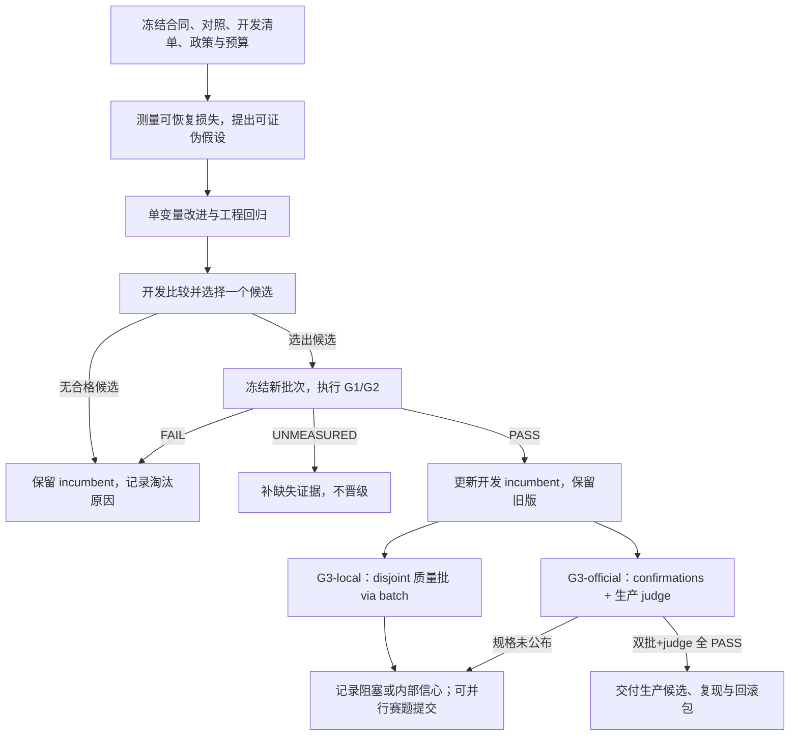

## Executive summary (read this first)

This plan defines three **internal** acceptance levels: reliable delivery (G1),
repeatable quality improvement (G2), and production validation (G3). Each promotion
compares an immutable candidate with its frozen incumbent on fresh evidence.
Passing these levels creates an internal release candidate; **only the organisers
can establish a winning rank**. G3 thresholds are not lowered after a G2 win.
G3 work is split into **G3-local** (disjoint quality rechecks via ordinary
`batch`; team-owned; does not flip toolkit G3) and **G3-official** (the
`confirmations` path: approved production NLI judge, dual batches, runtime
equivalence, artifact eligibility; organiser-bound and often UNMEASURED until
specs ship). As of the 2026-09-18 ruling (issue #8, final), Track 4 is
API-only against the House model: no BYO, LoRA, adapters, or participant model
weights, so every candidate is an API-mode agent. The hosted leaderboard track
is parallel to this ladder, not gated on full G3=PASS.

# Track 4 夺冠路径与迭代验收计划

## 1. 当前状态与规则来源

执行检查点（2026-09-18 复核）：**内部 goal 仍为 `BLOCKED` 于完整 G3**，但 G1/G2 已在私有密封验收上实测通过（容器工程门 + 含 classification/regression/ranking 分层的质量门）。G3 整体仍为 `UNMEASURED`：缺互不重叠的确认批、获准生产 judge，以及运行等价/工件资格合同。`decision` 在单批 G2 通过后仍可为 `KEEP_INCUMBENT`（政策要求 `confirmation_batches = 2`）。托管 Development 提交与本地晋级阶梯并行，不以完整 G3=PASS 为再提交前置。

同日裁定（issue #8，已关闭，组织方明示「will not be reopened」）：**Track 4 全程仅 `category = "api"`**——官方评测只走 House 模型（`MODEL_ENDPOINT` + `/v1`，bearer `MODEL_TOKEN`），无 fine-tuning、LoRA、adapter 或任何参赛方语言模型权重；toolkit 2.4.3 起 descriptor 不再接受 `byo-*`。当前公开操作性验证统一 pin v2.4.3（提交命令与该 tag 对齐）；历史 2.4.2 记录保持不可变，并不得与新环境结果混用。ARTIFACT-POLICY 允许的非语言模型本地数值工件不受此裁定影响。

当前缺口按能否本地推进拆分：

| 缺口 | 归属 | 说明 |
| --- | --- | --- |
| 互不重叠的确认事件库存 | **G3-local**（质量复测）/ 日后 **G3-official** | r8 类验收批已消耗一组密封事件；不得换皮重用。无生产 judge 时只用普通 `batch` 复测 |
| 获准生产 NLI judge / pins | **G3-official** | 官方规格未公布前，`production_faithfulness` 保持 UNMEASURED |
| 运行等价性、工件合规 | **G3-official** | 证据合同未落地前不得自证 PASS |
| 托管榜分数与弱 unit | **赛题主线** | 与内部 G3 并行，不互相阻塞 |

公开来源探查、历史快照与容器身份核验保存在私有证据目录，不能替代上述验收条件。工程 CI 或 PR 合并不改变 goal 状态。

官方评分器与评测闭环已在公开库落地。进入新实验前核对以下权威工件；合同或 judge 变化时，在同一新环境重跑双方。

| 权威来源 | 用途 |
| --- | --- |
| [官方评分实现](../qfbench2_track_analysis/)、[toolkit 安装说明](../README.md) | 固定评分器与共享 toolkit 源码身份，禁止改评分数学提高结果 |
| [提交合同](../SUBMISSION_CLI.md)、[训练政策](TRAINING-POLICY.md) | 核对运行资源、cutoff 和来源证明；模型类别以 issue #8 裁定为准（API-only，不再分 byo-*） |
| [生产 judge 答复](https://github.com/Agenthon-2026/track4-analysis-public/issues/1#issuecomment-5630517228) | 最近核查（2026-09-16）仍未公布生产规格；本地 smoke/Development 不在生产评分尺度 |
| [模型使用裁定](https://github.com/Agenthon-2026/track4-analysis-public/issues/8)（2026-09-18 关闭） | API-only 为最终政策：淘汰 BYO/LoRA/adapter 路径；候选范围只含 prompts/harness 与 ARTIFACT-POLICY 允许的本地数值工件 |
| [发布节奏](https://github.com/Agenthon-2026/track4-analysis-public/issues/2) | 核对正式版本公告（当前最新裁定：House route `/v1` 更正、toolkit 2.4.3），不凭旧评论推断规则已落地 |

术语见 [CONCEPTS.md](CONCEPTS.md)。incumbent 是当前保留版本，candidate 是待验收版本；晋级仅指内部更换版本。

API-only 裁定对本计划的实际影响：

- **候选空间收窄**：一切候选必须是 API 模式 agent（prompts、harness、检索与本地数值工件）。任何以 BYO/LoRA/adapter 为前提的在研分支、训练计划和验收安排即刻终止，不再消耗轮次预算。
- **工件资格简化**：G3-official 的 `artifact_eligibility` 不再涉及 adapter/权重审查；仍须核验非语言模型数值工件的许可、cutoff 与披露。
- **选优变量转移**：质量增益只能来自检索质量、提示与推理编排、校准和区间策略；迭代假设围绕这些变量提出。
- **toolkit 版本**：提交侧按组织方要求跟进 2.4.3；本地评分器 pin 变更时，对冻结对照在同一新环境重跑双方，不沿用旧环境结果。

## 2. 验收目标

每层记录 `PASS`（证据完整且合格）、`FAIL`（实测不合格）或 `UNMEASURED`（缺条件或测量）。失败单位保留官方最坏分并计入分母；组织方或数据故障中止评测，不改记参与者失败。缺失运行或分数不能删除后继续宣称均分有效。

| 目标 | 通过条件 | 必备证据 |
| --- | --- | --- |
| G1：稳定交付 | 声明清单的正常运行零机械失败；结构、实体覆盖、引用、cutoff、资源和请求账本合格；真实容器冷启动及故障演练通过 | 冻结清单、代码/依赖/镜像身份、逐单位运行与故障工件 |
| G2：可重复提升 | 双方 G1 通过；固定对照，在新验收批次上达到政策的样本、重复、配对提升和分层防退化要求（含三 target type 分层） | 完整双方报告、事件分组、配对区间与领域/target type 分层结果 |
| G3：内部生产候选 | 同一候选通过 G1/G2；**完整 PASS = G3-official**（见 §2.2）；G3-local 可选且不充分 | 确认批原始证据、judge 来源与 pins、逐单位 faithfulness、模型/选优来源说明、候选与回滚包 |

数值阈值唯一来源为 [acceptance-policy.json](../baselines/evaluation/acceptance-policy.json)，由 [acceptance.py](../baselines/evaluation/acceptance.py) 校验并以摘要绑定批次。这是内部政策，不是赛事规则或统计功效保证；**禁止按结果降低门槛**。

### 2.1 赛题主线 vs 内部阶梯

| 轨道 | 目标 | 与 G3 关系 |
| --- | --- | --- |
| 赛题（托管 Development / 正式评分） | 合规提交、复合分与忠实度门、榜上可见 | **不要求**本地完整 G3=PASS |
| 内部 G1/G2/G3 | 可证明的交付、增益与生产候选资格 | G3=PASS 只产生内部 release candidate，不能自称夺冠 |

### 2.2 G3-local 与 G3-official（不改门槛，只改排期）

`acceptance.py` 的 G3 检查保持原状；修订的是**执行预期**，不是政策数值。

| 子集 | 包含的检查（概念） | 谁能推进 | 在官方 judge 公布前的合法状态 |
| --- | --- | --- | --- |
| **G3-local** | 与 G2 **事件/input 不相交** 的第二（及后续）密封质量批：同一冻结 before/after，走普通 `batch register/run/decide`（可为 smoke） | 队伍：扩新鲜事件 → 密封 batch | 可测质量 PASS/FAIL；**不**调用 `confirmations.seal`，也**不**把 toolkit 总 G3 翻成 PASS |
| **G3-official** | `confirmations` 双批审计：`independent_confirmations`、`production_faithfulness`、`production_equivalence`、`artifact_eligibility` | 依赖获准生产 judge / pins 与证据合同；`confirmations.py` **强制** `profile=production` 且双方同一 `production_judge` | 规格未公布前预期 **UNMEASURED**，不记为工程失败 |

纪律：

- 不得用 smoke 忠实度冒充生产 NLI，不得把确认批降为 1 批来「提前 PASS」。
- **禁止**在无生产 judge 时调用 `confirmations.seal` 并宣称推进了政策意义上的 confirmation；无 judge 时只允许 G3-local 的普通 batch 质量复测。
- G2 上为分层覆盖引入的 classification/ranking **视图**若改变假设句形态，进入 G3-official 前须复查生产 judge 下的可证成性；不因此放宽政策。
- 本地 Docker / smoke 测量不证明官方环境等价。

事件内视图和 seed 先聚合，再按独立事件计算配对差值区间。验收清单预先平衡事件的视图/重复数，分层按领域和 target type 检查；非平衡设计须另定政策，不能事后换权重。置信区间衡量双方差值，不是要求各自的区间互不重叠。

G1 的 smoke 检查不包含生产 faithfulness。G2 可用 smoke 测量不含该门禁的质量提升；**完整 G3** 必须让双方使用相同获准 judge。生产门槛读取可信 card/plan 并逐单位核验，不能用总体均值代替。

主指标是既定验收分布上的综合得分。预测质量、原始误差、逐单位校准损失、证据错绑和 fallback 率用于定位损失；整个数据池覆盖率不能替代逐单位校准。区间宽度无单独奖励，改变区间仍会改变生产 judge 所核验的预测假设。

## 3. 数据与版本纪律

- 拟合/校准、开发选优和封存验收分别组织清单，使用现有 manifest 的合法 split。所有任务相关特征、标签和选优信息都必须在适用 cutoff 前可得；观察日期不等于首次公布日期。
- 开发数据可重复使用，不能再称未见数据。验收真值仅在预测结束后由评测流程读取；解封批次退出盲测池，不得反复调参、挑 seed 或换候选再验收。两批 G3 期间固定双方版本。
- 独立性依赖真实事件关系。实体行、视图、seed、领域名称或发布日期不增加独立样本；共享冲击跨领域仍只算一个总事件组。历史来源的能力和限制见[构建器说明](../baselines/evaluation/README.md#historical-snapshots-and-evidence-review)。
- 报告绑定源码、镜像、模型、judge、toolkit、数据和政策摘要。来源许可、首次可得时间、未参与选优及事件独立性须有另外的证明；本地登记器不能替这些事实背书。
- 真值、真实预测、实验报告、训练工件和 `ARTIFACT_PROVENANCE.md` 均保留在所有公共工作树之外。公开库只存通用实现、政策与合成测试，不新增官方 descriptor 字段或擅自上传 sidecar。

## 4. 一轮闭环

每轮优先处理开发集中的最大可恢复损失，综合事件覆盖、实施成本与合规风险提出一个主要机制假设。复用已有 evidence/reasoner/calibration 工具；机制交互用预先定义的消融比较。未晋级但得到可靠淘汰结论，也算有效迭代。

开发选优与新批次验收共用登记的轮次预算。选出一个不可变候选后，只允许它进入本轮新验收；接受过结果的批次不能换候选重试。G2 晋级后，G3 继续对比该次冻结的旧 incumbent，不与新 incumbent 自比。开发版本和生产资格分别记录。

验收通过后才晋级，并保留上一个版本。预测退化淘汰候选；机械、cutoff 或资源缺陷先修复，再按冻结与数据消耗规则创建合法的新运行。故障演练不消耗真实盲测批次。生产候选出现同类缺陷时撤销资格并回滚，历史证据保持原样。新增领域或改变 judge 需重新验收。

## 5. 执行入口与停止条件

操作顺序、参数和预算语义统一见[评测 README](../baselines/evaluation/README.md#internal-acceptance-and-sealed-batches)：故障证据 → 轮次与开发筛选 → 批次执行/判定 → 开发晋级/回滚 → 双批生产确认。它复用既有评分与统计工具，不另写评分公式。

轮次预先登记运行次数、最坏时长、请求/token 和支出边界；当前已登记执行器只授权离线 grounded 推理，不授权训练或收费调用。发生超限、不明计费、污染或账本缺失时中止。候选或预算耗尽则关闭轮次并保留结果；失败不退预算。旧的未登记实验不能追认搜索预算证据。

恢复当前 goal 只需出现能推进某一缺口的新证据，不要求全部条件同时到齐：

1. **数据就绪（G2 与 G3-local）**：核对许可、首次可得时间、独立分组与现行政策；G2 批次与后续质量复测批必须事件不相交。可提前规划日后 `confirmations` 用的库存，但不把全部确认库存就绪额外设为单独 G2 的前置门槛。
2. **来源资格补齐**：更新私有工件说明，重算候选适用范围；记录模型辅助选优、继承历史及后续来源浏览，不能因最终推理不调用模型就省略。
3. **生产配置就绪（G3-official）**：核对获准 judge 规格、缓存、运行条件及调用预算；规格未公布时停止空转探测，把状态记为 UNMEASURED 并转向赛题主线或 G3-local（普通 batch，不是 `confirmations.seal`）。
4. **赛题主线（并行）**：托管提交、弱 unit 与合同合规；不以完整 G3=PASS 为闸门。

没有可推进事项时记录真实阻塞，停止重复探测失败入口或追加无验收需求的工程。连续同类失败按会话纪律暂停分析，不以放宽政策、重跑或改分组制造成功。

## 5.1 下阶段可达目标（自 2026-09-19 起）

只列无需官方新规格即可推进、且完成条件可核验的目标；G3-official 不在其中（仍 UNMEASURED，等生产 judge 规格）。每条按 §5 的轮次与预算纪律登记执行。

| # | 目标 | 可达依据 | 可核验完成条件 |
| --- | --- | --- | --- |
| N1 | **终止 BYO 残留工作并回收预算**：关闭一切以 LoRA/adapter/自备权重为前提的在研分支、数据拟合与验收安排 | issue #8 裁定为最终政策 | 登记的轮次预算中无 BYO 前提项；候选清单全部为 API 模式；私有工件说明重算候选适用范围 |
| N2 | **toolkit 2.4.3 迁移演练（部分完成）**：公开 pin 与 API descriptor 已迁移；冻结 before/after 的同环境等价性仍 BLOCKED | 2.4.3 已发布且 descriptor 拒收 `byo-*` | 公开 pin 测试、unit validation、descriptor parse/reject 已通过；在冻结对照不可用前，不宣称 2.4.2/2.4.3 等价或晋级 |
| N3 | **赛题主线迭代一轮（候选门 FAIL）**：已完成 diagnostics 与 `change_bps` 单变量提示实验；真实模型 before/after rejection reduction 未测得 | House-compatible stub 可验证接口，但不能替代真实 House measurement | 保留 hosted incumbent；未达到真实改进门前不构建/推送新候选、不消耗 Development 上传额度 |
| N4 | **G3-local 质量复测一批（库存 BLOCKED）**：fail-closed 审计工具已完成；在取得足够新鲜事件前不注册 batch | 队伍自有数据通道，不依赖生产 judge | 新库存必须与已消费事件零交集且满足政策 minima；当前只记录 BLOCKED，不调用 `confirmations.seal`，不翻总 G3 |
| N5 | **每周一次官方信号核查**：周三更新帖（issue #2）与 issue #1 的生产 judge 规格 | 组织方公布节奏为每周三 | 每次核查留痕（日期、结论）；出现生产 judge 规格即按 §5 第 3 条恢复 G3-official；无新信息不追加探测 |

明确不做：不自证 G3=PASS、不以 smoke 忠实度冒充生产 NLI、不新增无验收需求的工程、不按结果降低 `acceptance-policy.json` 门槛。

## 6. 完成定义

同一个不可变生产候选完整通过 G1/G2/G3-official（`confirmations` + 获准 judge + 等价/工件核验），版本、数据、judge、政策、原始报告、工件许可、复现包及回滚链全部可核验，才标记 **内部** goal 完成。G3-local 质量复测可增强信心，但不是把总 G3 翻 PASS 的充分条件。当前生产运行等价性、工件资格和生产资格登记仍未完成时，确认审计保留 `UNMEASURED`。内部验收只覆盖报告声明的范围，不证明未来零失败或最终夺冠。
