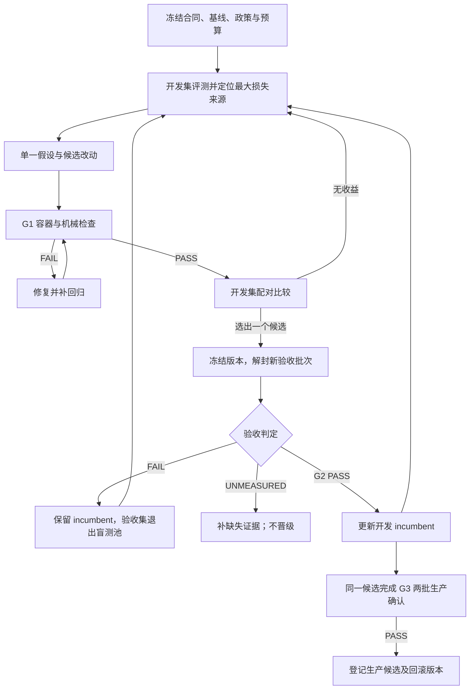

## Executive summary (read this first)

This plan defines an internal improvement loop with three acceptance levels: reliable delivery, measured predictive improvement, and production-judge validation across independent domains. Every candidate is compared with a frozen incumbent using the same data and scorer, with failed units retained in the score. Development data may guide iteration, but each promotion requires fresh sealed evidence that has not guided model selection. Missing production measurements remain unmeasured and never become a passing result. The evaluation tools now audit measured acceptance conditions and bind paired runs to a registered batch; missing resource and production evidence still prevents promotion. Passing all internal levels creates a release candidate, while only the organisers can establish a winning final rank.

# Track 4 夺冠路径与迭代验收计划

## 1. 当前基线与官方约束

本次规划基于本地 `origin/main` 的 `b9f2fad`。该版本已有实体与表格证据处理、结构化预测、独立评测、历史数据构建、区间校准及配对比较；不能再把这些全部列作从零开发。最近一次提交前检查为 673 项测试通过、11 个公开单位校验通过、示例 smoke 通过。它们证明工程回归通过，没有证明模型超过基线或生产 faithfulness 合格；本次未重新测量这些结果。

官方规则核查沿用 2026-09-15 快照：Track 4 `23da074`，共享仓库 `fbc57d29`。这是来源快照，不代表所有规则已经冻结，也不代表本 fork 已导入官方评分器修复。进入实验前先核对以下权威工件；发生变化就创建新的评测批次，并在同一环境重跑两个版本。

| 权威来源 | 对路线的约束 |
| --- | --- |
| [官方评分器与说明](https://github.com/Agenthon-2026/track4-analysis-public/tree/23da0746010f19f21f8b180953477fcd19675351/qfbench2_track_analysis) | 评分器升级需独立导入并验证，禁止自行改评分数学来改善结果 |
| [共享 toolkit 安装说明](https://github.com/Agenthon-2026/track4-analysis-public/blob/23da0746010f19f21f8b180953477fcd19675351/README.md) | 记录安装来源和源码摘要，不能只凭包显示版本判断实际代码 |
| [官方提交合同](https://github.com/Agenthon-2026/track4-analysis-public/blob/23da0746010f19f21f8b180953477fcd19675351/SUBMISSION_CLI.md) | House API 主线；BYO 仅在允许的 adapter 范围内；请求预算和运行资源从合同读取 |
| [离线训练政策](https://github.com/Agenthon-2026/track4-analysis-public/blob/23da0746010f19f21f8b180953477fcd19675351/docs/TRAINING-POLICY.md) | 拟合、选择、校准都受首次可得时间约束；保存 provenance 供核验，不擅自增加上传 ZIP 内容 |
| [judge 状态讨论](https://github.com/Agenthon-2026/track4-analysis-public/issues/1) | smoke/Development 不能替代生产 judge；未公布的 pins、运行等价性和校准不视为已完成 |
| [训练工件问题](https://github.com/Agenthon-2026/track4-analysis-public/issues/8) | 非 LLM 的已训练预测器、校准参数等能否随镜像提交仍需明确适用许可；离线比较不等于获准部署 |
| [发布节奏](https://github.com/Agenthon-2026/track4-analysis-public/issues/2) | 发布后按 commit/tag 比较合同，不依据旧评论推断规则已落地 |

术语见 [CONCEPTS.md](CONCEPTS.md)。本文将当前保留的最佳版本称为 incumbent，新实验版本称为 candidate；晋级指内部更换保留版本，不自动提交赛事或宣称可排名。

## 2. 三层内部目标与验收证据

三个目标分别记录 `PASS`（证据完整且合格）、`FAIL`（实测不合格）、`UNMEASURED`（缺数据、条件或样本量）。缺值不填零，不默认通过。工程通过后可以持续迭代预测；生产条件缺位只阻止生产资格结论。

| 目标 | 验收条件 | 交付证据 |
| --- | --- | --- |
| G1：稳定交付 | 对声明的完整验收清单逐次运行，所有预期正常运行成功；schema、roster、citation 边界、cutoff 和资源账本均通过；真实容器冷启动及故障演练完成 | 镜像摘要、输入清单摘要、代码/依赖版本、逐单位验证结果、请求和耗时记录、故障演练结果 |
| G2：可重复的预测提升 | 固定 incumbent，在独立且未参与选优的验收数据上满足下表样本要求与配对提升门槛；两个版本都满足 G1 | 完整原始报告、事件分组、评分器身份、配对比较、按 target type 与领域分层结果 |
| G3：内部争冠候选 | 同一固定候选通过 G1/G2；获准的生产 judge 在两批互不重叠的新验收事件上逐单位通过 faithfulness；每批都保持提升，且完成生产模型运行、工件合规及复现核验 | 两批独立验收报告、生产 judge 来源与运行 pins、每单位 faithfulness、模型和训练 provenance、发布候选摘要 |

G1 不等于官方四道门禁全部通过：`g3_domain_semantics` 中的生产 faithfulness 由 G3 核验。模型断网后产生合法输出，只证明该故障的恢复行为；不能因此宣称预测正确或生产合格。没有真实官方资源环境时，本地资源测试标明覆盖范围，对应官方环境等价性保持 `UNMEASURED`。

G3 是我们能够验收的生产就绪与泛化证据，不要求官方榜单开放才能继续其他工作，也不表示已经超过所有对手。正式榜单与最终审核是额外外部证据。

### 内部验收政策 v1

数值标准的唯一来源为 [acceptance-policy.json](../baselines/evaluation/acceptance-policy.json)，由 [acceptance.py](../baselines/evaluation/acceptance.py) 校验并以摘要绑定批次。这些是内部政策，不是赛事规则，也不保证样本统计功效；调整必须登记新版本并使用新批次，禁止按结果下调。

| 项目 | 配置与解释 |
| --- | --- |
| 独立样本 | `min_event_groups`、`min_domains`、`min_groups_per_stratum`；同事件多视图、实体和 seed 不增加独立样本数 |
| 实用提升 | `min_mean_gain`；同时要求配对差值的置信区间下界大于零 |
| 分层防退化 | `min_stratum_gain`；每个领域和 target type 分别判定，附事件样本数和区间 |
| 重复运行 | `min_repeats`；使用相同预设 seed 集合，重复不增加样本量 |
| 资源余量 | `max_p95_timeout_fraction`；每次运行还须满足权威合同的硬上限 |
| 独立确认 | `confirmation_batches`；固定候选和对照，分别验收而不合并掩盖失败 |
| 候选上限 | `max_candidates_per_round`；开发筛选后只冻结一个进入验收 |
| 配对统计 | `bootstrap_samples`、`bootstrap_seed`；比较器按事件分组重采样 |

验收集预先平衡每事件的单位/视图数及 seed 数；报告列完整单位均分，不确定性按事件组计算。非平衡设计须预先另定权重，不能直接套用事件等权结论。预期正常运行要求零机械失败；故意构造的故障演练单列。生产支持度按可信 card/plan 的阈值逐单位核验，禁止用总体均值替代。

预算、样本或生产条件不足时，继续积累开发证据，保持对应目标 `UNMEASURED`，不靠放宽统计口径凑达标。

### 主指标和辅助指标

主指标为既定验收分布上的综合得分，所有参与者失败单位保留官方最坏分并留在分母。评分函数调用共享 toolkit；组织方故障中止该评测，不改记参与者失败，也不丢弃后继续发布均分。

预测质量、原始数值误差、每单位 calibration 损失、证据错绑率和 fallback 率用于定位问题。按每单位先算 calibration 再汇总；整个数据池覆盖率接近目标值，不等于每单位损失小。纯标签任务无数值 calibration 项。interval 宽度本身不设奖励，但 interval 仍参与预测假设的证据核验，不能只靠扩大区间晋级。

G2 在 smoke profile 下可测开发综合得分提升，但明确不含生产 faithfulness；切换生产 profile 后，candidate 和 incumbent 必须用同一生产 judge 重评。95% 区间指配对差值的区间，不是要求两个版本各自的区间互不重叠。反复解封、多重选择或单领域样本都会削弱结论，因此开发提升和独立确认分开记录。

## 3. 数据与版本纪律

数据分为三个用途：拟合/校准、开发筛选、封存验收。使用现有 manifest 的合法 split，分别组织用途清单，不擅自给 CLI 增加不存在的 split 值。时间和事件组隔离由 [dataset.py](../baselines/evaluation/dataset.py) 校验，使用方法见 [评测说明](../baselines/evaluation/README.md)。

- 拟合、选择、校准所用标签的首次可得时间必须早于适用任务 cutoff；历史观察日期不等于公布日期。整个候选选择过程同样受此约束。
- 开发集允许反复诊断和选优，但不再提供“未见数据”证明。封存验收由独立的评测流程在预测完成后读取真值，开发侧不能用验收真值指导本轮候选。
- 每批解封后标记 consumed。需要诊断时移入开发资料；它不能再作为下一轮独立确认，后续使用仍受相应 cutoff 限制。两批 G3 验收期间不修改候选。
- 真值、训练数据、诊断答案和实验报告全部存放于本公共仓库各工作树之外的私有目录；公开库只提交通用代码、政策和合成协议测试，禁止引入任何真实答案或对抗变体细节。
- 所有报告绑定源代码、镜像、模型、judge、toolkit 和数据摘要。选择 incumbent 不能只写分支名，也不能拿不同 judge 或不同清单的结果直接比较。

现有[历史构建器](../baselines/evaluation/historical.py)支持利率、通胀、外汇和能源的有限历史来源，具体系列与目标定义见[使用说明](../baselines/evaluation/README.md#historical-snapshots-and-evidence-review)。三种 target view 不增加独立事件数；不同领域若共享同一市场冲击，也不能仅凭领域名不同就认定独立。开发来源扩展不等于验收样本达标：公开许可、首次可得时间、目标定义、证据质量及跨领域时间依赖均需核验，开发数据不得重新标记为新盲测。

## 4. 一轮闭环：从失败到下一版基线

每轮开始先写一条可证伪的假设，例如“实体错绑是该领域最大损失来源；只修改实体约束后，错绑减少且综合得分达到晋级标准”。优先按开发集中的可恢复综合得分损失、影响事件数、实施成本和合规风险选题。一次只改一个主要机制，避免无法归因；机制交互用预先定义的消融比较。

| 环节 | 责任角色 | 输入 → 输出 | 决策 |
| --- | --- | --- | --- |
| 冻结 | 实验负责人 | 合同快照、incumbent、数据清单 → 实验登记 | 无唯一版本、预算或可用验收批次则不启动昂贵实验 |
| 测量 | 评测流程 | 固定模型与清单 → 逐单位报告、账本 | 缺失运行保留，数据/组织方故障中止 |
| 诊断 | 实验负责人 + 证据审阅流程 | 开发报告 → 一个主要失败归因、可证伪假设 | 看预测假设及原文证据，不以生成解释好看为依据 |
| 改进 | 实现流程 | 假设 → 单变量改动、对应回归 | 优先复用现有 evidence/reasoner/calibration 模块 |
| 验收 | 与选优隔离的评测流程 | 冻结候选、未解封数据 → G1/G2/G3 状态及理由 | 缺证据与实测失败分开，禁止自填 PASS |
| 晋级 | [开发版本执行器](../baselines/evaluation/lifecycle.py) | 原始批次证据与政策 → 新开发 incumbent 或保留旧版本 | 已接通 G1/G2 开发晋级和回滚；生产资格另验，不自动上传或合并 |
| 沉淀 | 实现流程 | 经确认的原因 → 回归/诊断能力、下一轮待办 | 真实事件资料留私有目录，公共测试使用合成数据 |

角色是责任边界，不要求增加人员或启动并行 Agent。真实业务/许可判断由负责人处理，可计算的状态、计数和比较由脚本执行。

## 5. 停止、回滚与预算

开发 incumbent 与生产候选分别保存，另保留上一个已验收版本。G2 晋级后，G3 仍对比该次实验冻结的旧 incumbent，不将新 incumbent 与自己比较；两批生产确认使用同一个对照版本。普通开发集预测变差意味着淘汰候选；机械、cutoff 或资源缺陷则先修复再恢复该候选评测。生产候选发现同类缺陷立即撤销内部资格并回退保留版本，历史报告保持不变。

任何晋级只覆盖报告列明的领域、时间范围、样本和环境，不推断未来失败率为零。新增领域或更新 judge 后重新验收；通过更多单测不能替代新环境证据。

每轮登记最大请求尝试数、输出 token 上限、总运行次数、墙钟时间和支出上限。单次运行的上限读取权威合同，跨运行预算由当前授权决定；没有预算授权时只做本地确定性工作，不启动训练或收费批量调用。超过上限、出现不明计费、数据污染或不完整账本，终止该轮并输出原因。

完成每个候选即比较，耗尽候选上限便结束本轮。没有达到晋级门槛时保留 incumbent，也算完成了一次有结论的迭代。连续三次同类失败按会话纪律暂停分析并记录阻塞，禁止无依据换 seed、放宽政策或重试到成功。

## 6. 现有工具与待补自动化

本节明确实施边界：已有诊断判定器、离线批次登记器、冻结容器清单及资源/故障核验；客户端请求计数已接入诊断；开发晋级、回滚和登记验收批次的轮次预算已接通。开发搜索预算、生产确认及生产资格登记仍未完成。没有真实验收通过的候选时继续保留 incumbent。

| 能力 | 当前入口 | 覆盖范围 / 下一步 |
| --- | --- | --- |
| 工程回归 | [preflight.sh](../scripts/preflight.sh)、[容器 smoke](../baselines/smoke_image.sh) | 已有 lint、测试、单位校验和离线容器入口；已有客户端请求硬上限与账本诊断；完整模型故障、代理计费及资源验收仍需补证据 |
| 数据及运行 | [evaluation CLI](../baselines/evaluation/__main__.py)、[dataset.py](../baselines/evaluation/dataset.py) | 已有外置真值、隔离运行、清单与 split 校验；[batch.py](../baselines/evaluation/batch.py) 已支持冻结、运行回执与一次性判定 |
| 证据诊断 | [review.py](../baselines/evaluation/review.py) | 已有预测假设、引用原文和有来源的审阅标注；未审阅不得当支持 |
| 区间实验 | [calibration.py](../baselines/evaluation/calibration.py) | 已有外置残差校准；结果可比较，但工件部署许可须单独核对 |
| 配对提升 | [compare.py](../baselines/evaluation/compare.py) | 已有相同清单/评分器检查和事件 bootstrap；已增加领域及 target type 的事件区间；样本量和平衡权重由 acceptance 检查 |
| 三层验收 | [acceptance.py](../baselines/evaluation/acceptance.py) 与版本化政策 | 已核对 G1 冻结清单、容器资源及同镜像故障工件，分别审计候选与基线；G3 生产证据通路待补，不将诊断当晋级 |
| 故障恢复 | [faults.py](../baselines/evaluation/faults.py) | 用纯合成协议工件运行同镜像真实进程，核对请求接收记录、完整输出和 fallback；不替代预测质量或生产 judge |
| 批次与开发版本 | [batch.py](../baselines/evaluation/batch.py)、[lifecycle.py](../baselines/evaluation/lifecycle.py) | 已冻结版本、输入/真值摘要和 seed，拒绝重复事件或角色重跑；每轮只允许一个选定候选进入验收，另冻结运行次数及最坏执行时长，失败不退额度；重验 G1/G2 后更新开发基线，支持关闭批次和回滚；开发候选上限、搜索预算与生产确认待补 |

判定器的最低回归要求：缺少 production judge 的 smoke 报告不能通过 G3；漏运行/漏真值不能通过 G2；重复事件或 seed 不能凑样本；不同 toolkit/judge 不可比较；均值变好但配对区间跨零不能晋级；失败单位不能删除；消耗过的验收批次不能重新标为独立；不同版本的报告不能拼成一次通过。

内置策略配置是数值阈值的唯一来源；实验决策文件存放私有运行目录，不向官方 submission descriptor 增加字段。现有比较器的 `by_split.test` 结果可作为输入，不能直接把所有 train/calibration/test 混合的 overall 当验收。

## 7. 启动顺序与完成定义

1. **先闭合最小链路。** 导入必要的官方合同修复并保留 fork 能力，建立版本化政策与判定器；用合成报告验证缺证据不通过，产生第一份真实状态清单。此步完成不要求生产服务或训练预算。
2. **建立 incumbent 的证据底稿。** 用现有工具评测公开输入和合规私有开发集，记录缺口；冻结数据/模型/镜像与政策。公开无真值单位只计工程证据。
3. **交付首轮有效改进。** 从开发集最大损失来源选择一个机制，跑完整 G1→开发筛选→新批次 G2。产出可复现的晋级或淘汰理由；不以必然晋级为目标。
4. **扩大证据范围。** 补足不同领域及独立事件、生产运行和计费记录；生产 judge 可用后，固定候选执行 G3 两批确认。缺位项继续显示 `UNMEASURED`。
5. **持续运行。** 每次晋级更新对应 incumbent，下一轮必须对比它；每次失败减少一个已证实的不确定性或补一条有效回归。周期评审时只看状态、提升、证据缺口和投入，不用完成任务数代替竞争力。

内部交付完成定义：同一个不可变生产候选满足 G1/G2/G3，复现材料、工件许可和回滚版本完整；后续迭代继续挑战 incumbent。内部验收不能证明对手水平或隐藏测试排名，最终夺冠仍以官方结果为准。
